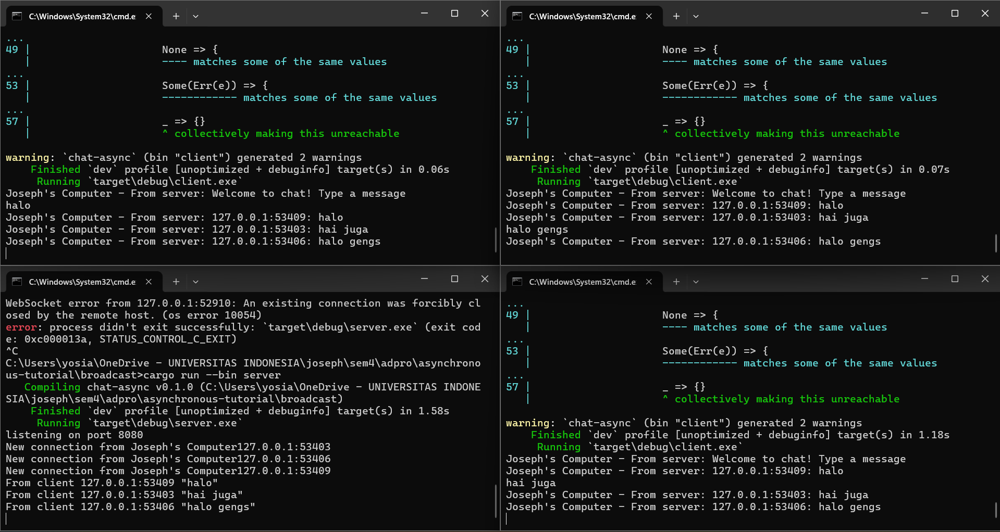

# experiment 2.1

To run the chat application:

Start the server
Open a terminal and run:

cargo run --bin server

This will start the server and listen for WebSocket connections on ws://127.0.0.1:2000.

Start one or more clients
In separate terminals, run:

cargo run --bin client

When I type a message in one client and press Enter, the message is sent to the server.
The server broadcasts this message to all connected clients (including the sender).
Every client displays the message in their terminal, prefixed by the sender's address (e.g., 127.0.0.1:52093: halo).
This means all clients see every message sent by any client, including their own.
It's a simple real-time chat: every message I type is instantly visible to all connected clients.

# experiment 2.2
Yes, the server code is using the same WebSocket protocol as the client.

Both the server (server.rs) and client (client.rs) use the tokio_websockets crate, which implements the WebSocket protocol.
On the server side, the line:

let (_req, ws_stream) = ServerBuilder::new().accept(socket).await?;

upgrades the incoming TCP connection to a WebSocket connection.
On the client side, the line:

let (mut ws_stream, _) = ClientBuilder::from_uri(Uri::from_static("ws://127.0.0.1:8080")).connect().await?;

connects to the server using the WebSocket protocol.

Both sides use the WebSocket protocol for communication, ensuring compatibility and real-time, bidirectional messaging.

# experiment 2.3

Modify server.rs:

In the main function, change the new connection log message to println!("New connection from Joseph's Computer{addr}");.
In the handle_connection function:
Send a welcome message ("Welcome to chat! Type a message") directly to the newly connected client when the connection is established. This message is not broadcast to other clients.
When a message is received from a client:
Log this incoming message to the server's console in the format From client {addr} "{text}".
Change the format of the message to be broadcast. Instead of "[Client {addr}]: {text}", it will be {addr}: {text}. This is what other clients will receive and then format further.

Modify client.rs:

When a message is received from the server, prepend the string "Joseph's Computer - From server: " before printing it to the console. This applies to both the welcome message and subsequent chat messages.

This will result in the client displaying messages like: Joseph's Computer - From server: Welcome to chat! Type a message Joseph's Computer - From server: 127.0.0.1:XXXXX: hi

And the server logging: listening on port 8080 New connection from Joseph's Computer127.0.0.1:XXXXX From client 127.0.0.1:XXXXX "hi"